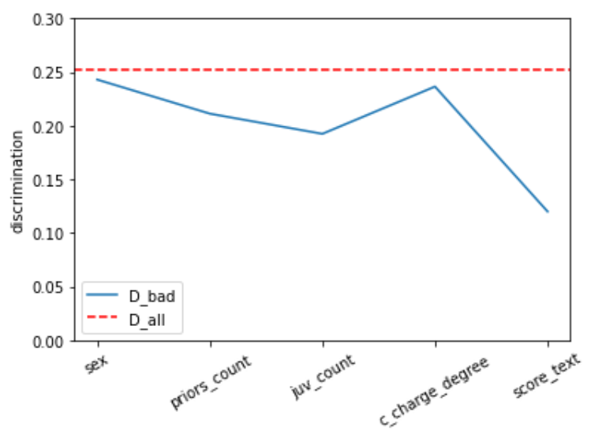
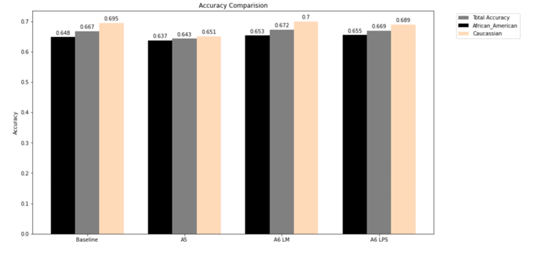
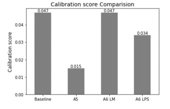
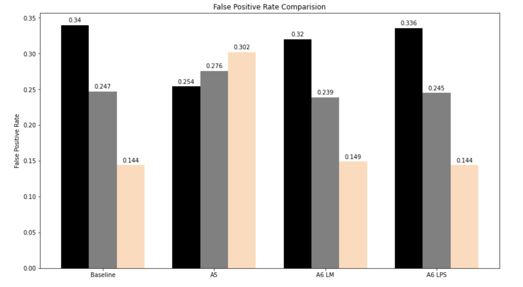

# Fairness in AI - COMPAS Recidivism

## Objective:

Fairness algorithms, a recent topic in machine learning, aims to avoid outcome decisions that are unfair to certain groups or individuals. In this project we implement two of such fairness algorithms, [Fairness-Aware Classifier with Prejudice Remover Regularizer](https://www.researchgate.net/publication/262176212_Fairness-Aware_Classifier_with_Prejudice_Remover_Regularizer) and [Handling Conditional Discrimination](https://www.researchgate.net/publication/220766841_Handling_Conditional_Discrimination), in an attempt to reduce racial bias and improve fairness in recividism predictions for individuals.

 

## Dataset:
COMPAS (Correctional Offender Management Profiling for Alternative Sanctions) is a popular commercial algorithm used by judges and parole officers for scoring criminal defendant’s likelihood of reoffending (recidivism). The dataset used in this project contains variables used by the COMPAS algorithm in scoring defendants, along with their outcomes within 2 years of the decision, for over 10,000 criminal defendants in Broward County, Florida. 

 

## Accuracy Metrics:
The metric for evaluating fairness varies based on the context of the problem. However, in this project comparions between the algorithms were made on the basis on overall accuracy, calibration score ( difference between accuracies of each class) and False Positive Rate (FPR) of each class.

 

## Methodology:
A logistic regression model was first implemented to acquire baseline prediction metrics for the dataset. Recidivism predictions were obtained by implementing the two fairness algorithms and then the metrics of all the models were compared.

 

## Fairness-Aware Classifier with Prejudice Remover Regularizer:

Even if the sensitive variable (race, in this project) is removed from the model, there might be other variables in the dataset that are related to the sensitive variable which might lead to indirect dicrimination (also referred as red-lining). 'Prejudice' is defined as a statistical dependence between a sensitive varible 's', and the target variable 'y', or a non-sensitive variable 'X'. This algorithm aims to reduce the Prejudice in the model, and thus improve fairness of predictions.

Objective function to minimize:

  

The reduction in prejudice usually comes at the cost of model accuracy, and hence the model performace drops as fairness increases.

 

The x-axis of the graph shows eta values which is a fairness parameter (higher eta leads to more fairness), the numbers on the left y-axis show overall accuracy of the model and the numbers of the right y-axis show the Calders-Verwer Score, which is the difference in accuracies of both classes (a metric for fairness)

The link for paper with all details of the algorithm :
https://www.researchgate.net/publication/262176212_Fairness-Aware_Classifier_with_Prejudice_Remover_Regularizer

 

## Handling Conditional Discrimination:
This paper argues that most fairness techniques aim to remove all discrimination and do not take into account the part of discrimination that may be explanable by other attributes, which may lead to reverse discrimination against the privileged class. In this context, the paper introduces and analyzes the issue of
conditional non-discrimination in classifier design.

The method proposed invovlves finding an appropriate explanatory variable 'e' which is correlated with the sensitive variable 's' and gives some objective information about the taget varaible 'y'. The discrimation based on the explanatory varaible is broken down into two components - bad discrimination and explanable discrimination, and then algorithms such as local massaging and local preferential sampling are proposed to remove only the bad discrimination in the model.

The above plot shows the total and bad discrimination components for each variable used as the explanatory variable. For further comparisions, score_text variable was used as the explanatory variable since it had the highest explanable discrimination value, however in practice the choice of the explantory variable would be heavily influenced by the current laws and policies in place.

The link for paper with all details of the algorithm :
https://www.researchgate.net/publication/220766841_Handling_Conditional_Discrimination

 

## Results:

Below plots show the comparision of prediction metrics of all the models. A5 refers to the "Fairness-Aware Classifier with Prejudice Remover Regularizer", A6 LM refers to "Local Massaging algorithm with conditional non-discrimination classifier" and A6 LPS refers to "Local Preferential Sampling algorithm with conditional non-discrimination classifier".

 

Accuracy:

  

 

Calibration Score:

   

 

False Postive Rate (FPR):

  
